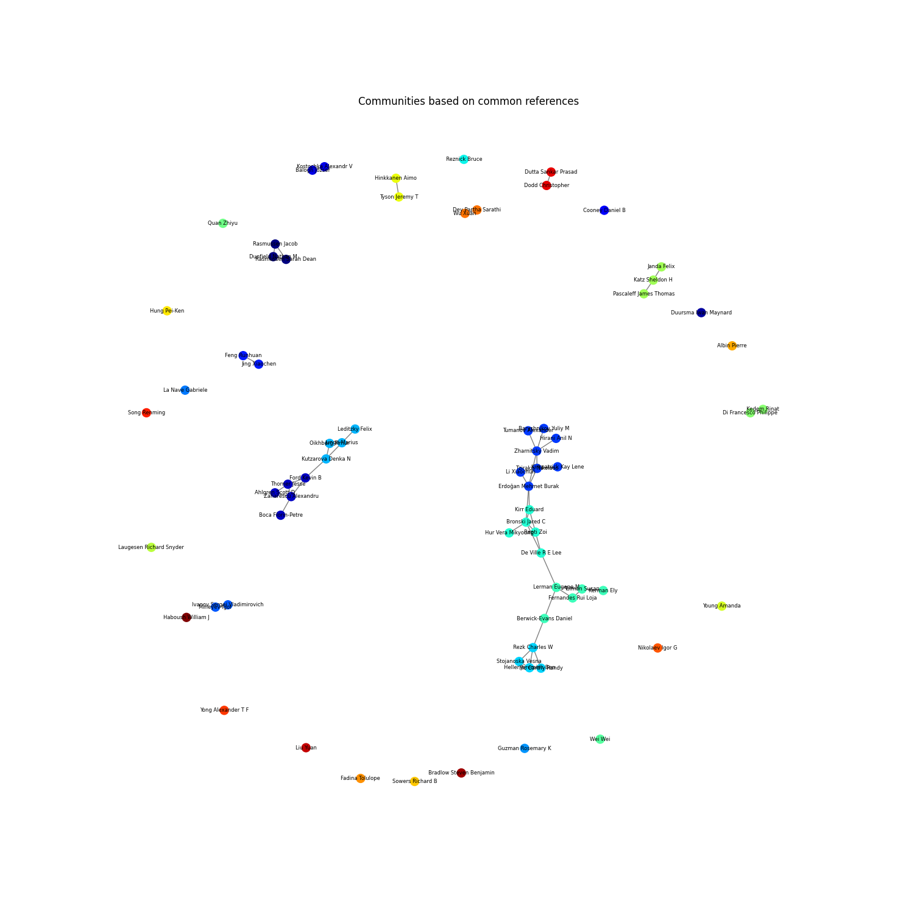

### Community detection in math departments

This repository contains python scripts for detecting community structure in graphs from math publication data. This uses the [communities](https://github.com/shobrook/communities) library. The data used is from a [previous project](https://github.com/sujeet-bhalerao/Deep_Structure) as part of the [Illinois Geometry Lab](https://math.illinois.edu/research/illinois-geometry-lab).

The folders `data/citations` and `data/papers` contain all data. 

`process_data` has scripts which extract similarity matrices from the publication data.

`community-detection/community-detect-anim.py` creates `viz_graph.png` and also prints a list of communities detected based on data for common references using the [Louvain method](https://en.wikipedia.org/wiki/Louvain_method).

